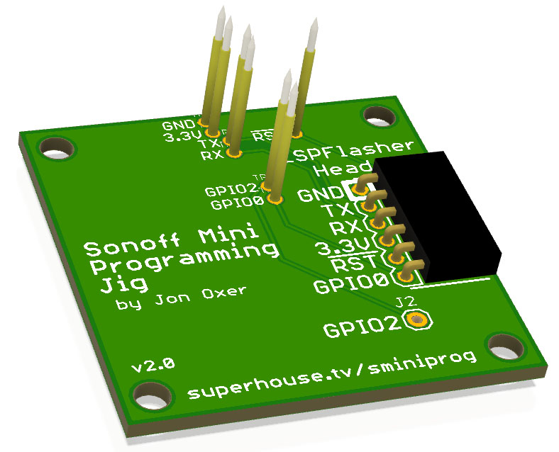

Sonoff Mini Programming Jig
===========================
Copyright 2019-2020 SuperHouse Automation Pty Ltd  www.superhouse.tv  

Pogo pin board for programming a Sonoff Mini using the test points on
its PCB.

Exposes the connections to an ESP-Prog header, which can be used for
discrete wire connections or to plug in an ESPFlasher programmer.

www.superhouse.tv/sminiprog

INSTALLATION
------------
The design is saved as an EAGLE project. EAGLE PCB design software is
available from www.cadsoftusa.com free for non-commercial use. To use
this project download it and place the directory containing these files
into the "eagle" directory on your computer. Then open EAGLE and
navigate to the project.

DISTRIBUTION
------------
The specific terms of distribution of this project are governed by the
license referenced below.

LICENSE
-------
Licensed under the TAPR Open Hardware License (www.tapr.org/OHL).
The "license" folder within this repository also contains a copy of
this license in plain text format.

CREDITS
-------
Designed by Jonathan Oxer (jon@oxer.com.au)
